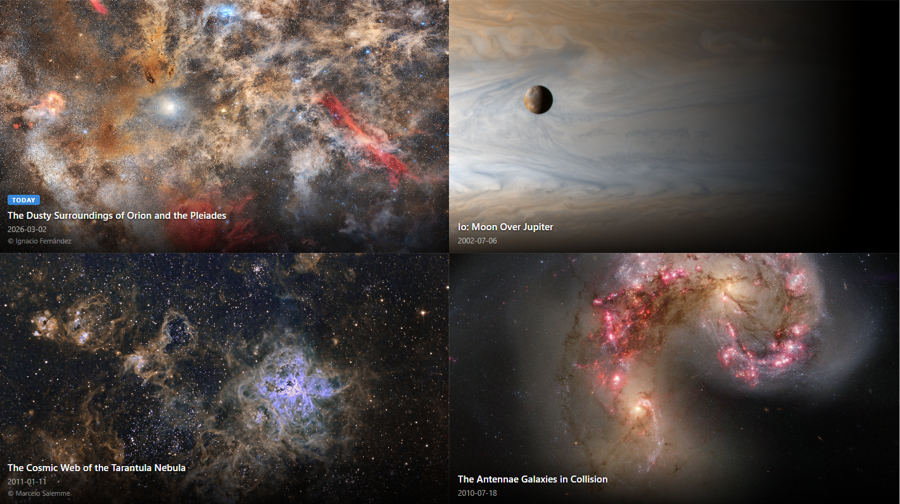

# NASA APOD Gallery

A full page 2x2 grid gallery of NASA [Astronomy Picture of the Day](https://apod.nasa.gov/apod/astropix.html) images. This was designed for unattended display on TVs, digital signage (e.g. Yodeck, Screenly, etc.), or as a browser wallpaper.

- **Top-left cell** shows today's APOD
- **Other cells** show randomly selected past APODs
- Grid scales dynamically to any display size or aspect ratio
- Videos (YouTube embeds) play muted and looping
- Configurable via URL parameters

## Live Demo

> [!NOTE]
> View the live demo here: [https://jwidess.github.io/nasa-apod-gallery/](https://jwidess.github.io/nasa-apod-gallery/)

## Example Image


## URL Parameters

All parameters are optional. Combine them freely:

| Parameter | Default | Description |
|-----------|---------|-------------|
| `api_key` | `DEMO_KEY` | Your [NASA API key](https://api.nasa.gov/#signUp). `DEMO_KEY` is rate-limited to 30 req/hr and 50 req/day per IP. |
| `refresh` | `0` (off) | Auto-refresh interval in **seconds**. `0` disables auto-refresh. Minimum `10` when non-zero. Note: if `cache` TTL is longer than this interval, refreshes will serve the cached data until the TTL expires. |
| `overlay` | `always` | Info overlay visibility: `always`, `hover`, or `none` |
| `fit` | `cover` | Image scaling: `cover` (fill cell, may crop) or `contain` (full image, black bars) |
| `cache` | `3600` | localStorage cache TTL in **seconds**. Skips NASA API calls on page reload if the cache is fresh. `0` disables caching. Minimum `10` when non-zero. Cache is also invalidated when the UTC date changes (new day = new APOD). |

### Examples

```
# Personal API key, refresh every hour, hover-only overlay
https://jwidess.github.io/nasa-apod-gallery/?api_key=YOUR_KEY&refresh=3600&overlay=hover

# TV wallpaper - no overlay, refresh every 30 minutes
https://jwidess.github.io/nasa-apod-gallery/?api_key=YOUR_KEY&refresh=1800&overlay=none

# Contain mode to see full images without cropping
https://jwidess.github.io/nasa-apod-gallery/?fit=contain&overlay=always
```

## Getting a Free NASA API Key

Register at [https://api.nasa.gov/#signUp](https://api.nasa.gov/#signUp) to get your own free API key.

## Tech Stack

- [React 19](https://react.dev/) + [TypeScript](https://www.typescriptlang.org/)
- [Vite 7](https://vite.dev/)
- NASA [APOD API](https://github.com/nasa/apod-api)

## License

GNU Affero General Public License v3.0 